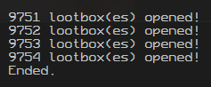

# Discord Lootbox Automator

### What?
> Basically for April Fools day, Discord added lootboxes, where you could get 1 of 9 possible rewards. Opening a certain amount would earn you the clown decoration, and when equipped, the lootbox badge on your account.
>
> This Python script basically automated opening them, but using keyboard and mouse modules. Another method I heard someone use was to find the call for opening lootboxes in web Discord and wrap it in a while loop to call it over & over again.
>
> Note that the coordinates for the open lootbox button and the lootbox itself were hardcoded to work on my tiny square monitor.
>
> Below is a screenshot of my terminal output after I ran it for the last time, and the total boxes opened using my program.

